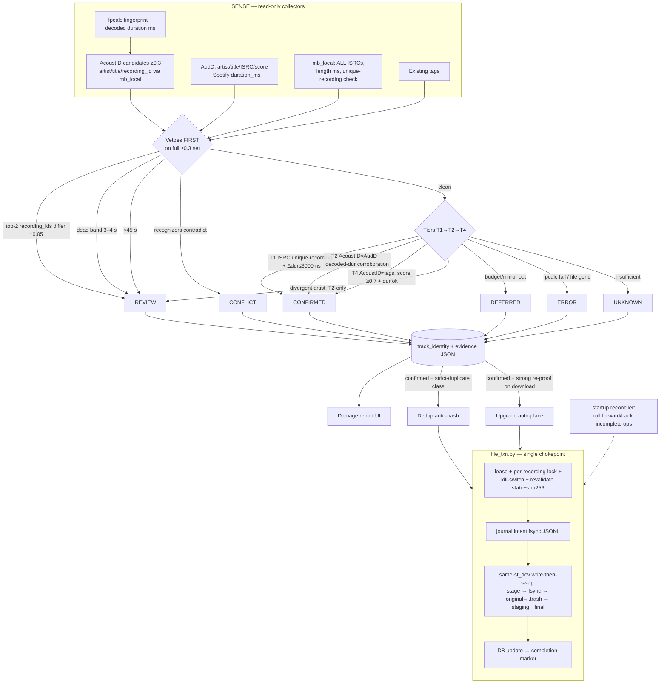

# feat: Identity Resolver Phase 1 + Identity-Gated Dedup + Verified Upgrades (v2, post-boardroom)

**Target repo:** `music-machine` on Beast (`/home/olares/projects/music-machine`). Container `music-machine` (:8686) — **currently stopped** to halt mislabeling.

---

## Summary

Build the SENSE→DECIDE core of the bulletproof-identification design (see origin: `docs/brainstorms/2026-06-11-bulletproof-identification-brainstorm.md`): a new `track_identity` table populated by a consensus resolver (tiers T1 ISRC-proof / T2 cross-recognizer / T4 tag-corroboration, plus hard vetoes), a resolve-only sweep over the whole library, and a damage-report UI. **No tag writes in this phase.** On top of confirmed identities, add the two ACT operations Blair requested: (1) duplicate removal — auto-trash strictly-identical copies of the same confirmed recording into a durable, manifest-journaled reversible trash; (2) quality upgrades — usenet-first (Lidarr/SAB) with MusicGrabber as a review-gated fallback, every download independently identity-resolved and integrity-checked before placement.

Safety invariant carried from the brainstorm and hardened by adversarial review: **100% precision on automatic actions.** The system never writes a wrong tag, never trashes/overwrites a correct original, never places a wrong or fake file. Slowness and "do nothing" are always acceptable outcomes. Every fix in this revision moves toward "slower, or do nothing" — never toward throughput at precision's expense.

---

## Problem Frame

Five independent writers mislabel and move files on weak single-source evidence (see `docs/MATCHING-CURRENT-STATE.md`). The confidence formula rewards metadata completeness, not correctness; `matches[0]` is taken blindly; errors propagate into folder moves and wrong-artist re-downloads. Library also carries accumulated duplicates and lower-resolution copies. Container is stopped; nothing can be re-enabled until identification is trustworthy and the old writers are gated. The library lives on NFS — which provides neither the atomicity nor the locking the previous design implicitly assumed; this revision treats NFS as adversarial.

---

## Requirements

- R1. New `track_identity` table — single source of identity truth with full evidence audit trail. (origin §1–2)
- R2. Confirmation tiers T1/T2/T4 + hard vetoes + divergence escalation, implemented as a pure evidence→verdict function with a documented state-transition map. (origin §3)
- R3. Resolve-only sweep over the library (resumable, lease-fenced, budget-aware) writing only `track_identity`. (origin §6 step 2)
- R4. Damage report: counts + browsable buckets (confirmed-matches-current / confirmed-contradicts-current / review / conflict / unknown / deferred / error). (origin §6 step 3)
- R5. Container restart must be safe: no legacy writer may fire, enforced at the lowest write primitive, fail-closed.
- R6. Duplicate removal: strictly-identical copies of the same **confirmed** recording auto-trashed; same-recording-but-not-identical-audio → review queue; reversible via durable journaled trash. (user decision 2026-06-11: auto-trash when identity-confirmed; tightened to strict-duplicate class per boardroom #14)
- R7. Quality upgrades: for confirmed tracks, fetch highest-available resolution usenet-first (Lidarr); auto-placement only on strong independent proof (downloaded file itself resolves to the same `mb_recording_id`); MusicGrabber and weak-proof candidates → review queue. (user decision 2026-06-11: usenet-first; auto-place gates tightened per boardroom #5/#6)
- R8. All destructive file operations crash-safe, journaled, idempotent, and reversibly restorable — on NFS semantics, not POSIX-local assumptions.

Out of Phase 1: T3 album lock (tier number reserved — see KTD 3 note), tag writing/repair pass, reorg gating, Plex sync rewrite, art fetcher, review-decision feedback ledger (origin §10 phases 2–4).

---

## Key Technical Decisions

### Identification

1. **Six identity states with an explicit transition map.** `confirmed | review | unknown | conflict | deferred | error`. `deferred` = sensing incomplete (AudD budget exhausted, mirror down); `error` = mechanical failure (fpcalc failed, file missing). Transition map documented in `backend/identity_resolver.py` module docstring and enforced: `deferred`/`error` → re-resolved automatically; `review`/`conflict` → `confirmed` only via human decision (Phase 4 UI); `confirmed` → superseded only by higher-tier evidence at a bumped `resolver_version` or explicit human override. Damage report never presents "not yet sensed" as a verdict.
2. **Tier numbering: T1/T2/T4 with T3 explicitly reserved.** T3 = album lock, deferred to Phase 2 by design (origin §10). The gap is intentional, not a typo — stated in code comments and plan to prevent "missing tier" confusion. (boardroom #24)
3. **T1 requires a unique recording.** AudD ISRC ∈ MB recording's ISRC list confirms only when that ISRC maps to exactly **one** MB recording (after lookup against mb_local). ISRC reuse / multi-mapping → `review` unless independent evidence disambiguates. (boardroom #18)
4. **T2 independence is verified, not assumed.** Before trusting AcoustID+AudD agreement as two witnesses, document AudD's reference-DB provenance (implementation-time check). T2 confirms only with an additional corroborator: decoded-duration tight match (≤3000 ms) against the MB canonical recording length. Absent that corroboration → `review`. Correlated upstream mislabels are the known residual; this bounds them. (boardroom #20)
5. **Durations in milliseconds end-to-end.** mb_local returns recording length in **ms** (native MB unit, no truncation); AudD duration from Spotify `duration_ms`; the file's own duration = **decoded audio length** (ffprobe/sample count), never the stored tag (tags were written by the mislabeler). Windows pinned with closed/open inequalities: confirm `Δ ≤ 3000 ms`, dead band `3000 < Δ ≤ 4000` → review, hard veto `Δ > 4000`. `NULL`/undecodable duration → duration-dependent tiers unavailable, never silently passing. Duration may **confirm** identity, never establish it. Seconds only at display. (boardroom #19)
6. **Ambiguity veto runs on all retained candidates, keyed on recording id.** `lookup_acoustid` retains candidates down to score 0.3; tiers use only ≥0.5, but **all vetoes evaluate against the full ≥0.3 set, strictly before tier assignment** (test-asserted ordering). Veto fires when the top-2 **`mb_recording_id`s differ** and scores are within 0.05 — regardless of artist (same-artist different-recording is exactly the live/remaster trap). A second candidate with the *same* recording id strengthens rather than vetoes. (boardroom #21)
7. **New shared normalizer, resolver-only consumer in Phase 1.** `backend/normalize.py` (casefold, diacritics, feat./ft., remaster/deluxe/single-version suffixes, leading "The", token-set compare). The three legacy normalizers stay untouched (behavior change in three live consumers); golden tests pin all four, plus a **differential corpus** (unicode, diacritics, punctuation, feat-variants) that documents exactly where the canonical normalizer diverges from each legacy one. Decisions use the canonical normalizer only. (boardroom #25)
8. **mb_local is mandatory for the sweep.** Mirror down → public-API fallback silently loses ISRCs, killing T1 with no signal. Sweep hard-stops (status `mirror_unavailable`) rather than degrading.

### Storage & crash safety (boardroom cluster 1)

9. **SQLite DB and trash manifests live on local disk, never NFS.** DB already at `/data/music-machine.db` (bind-mounted `./data` on Beast's local disk) — now stated as a hard requirement with a startup assertion (refuse to run if `DB_PATH` resolves to an NFS mount). WAL mode with a **single serialized writer** (one writer connection/queue shared by sweep, dedup, upgrade workers). Manifests/journals under `/data/file-txn/`. (boardroom #4)
10. **All destructive file flows go through one journaled transaction layer** — new `backend/file_txn.py`. Idempotent state machine per operation: `intent → original_quarantined → replacement_staged → replacement_committed → db_committed → finalized`, each step recorded in an **append-only JSONL journal, one record per op** (never a shared read-modify-write array): write temp file in same dir → `fsync(fd)` → `rename` → `fsync(dirfd)`. Durable intent record verified (read-after-write) **before** any destructive rename; completion marker after the DB commit. A `.op-in-progress` sentinel sits next to the target during the window. **Startup reconciler** (lifespan, blocking, before any worker starts) rolls forward/back any op lacking a completion marker. Invariant: filesystem reality is always ahead-of-or-equal-to DB state. (boardroom #2, #3)
11. **Write-then-swap on one filesystem; trash is per-export.** Placement order: (1) write new file to `<dest-dir>/.staging/`, (2) fsync file + parent dir, (3) `rename` original → per-export `.trash/` (atomic, same device), (4) `rename` staging → final path, (5) DB update, (6) journal completion. Before any move, assert staging, destination, and trash share one device (`st_dev`); any cross-device condition → abort to review / do nothing (never let `shutil.move` silently degrade to copy+unlink on the destructive path). Trash roots chosen by the file's own `st_dev` — one `.trash` per mount, never a single global dir. Fixes the live FLAC→FLAC overwrite bug (`backend/routes/upgrades.py:483-509`) structurally. (boardroom #1)
12. **Restore is non-destructive and idempotent.** If the original path is occupied at restore time, restore to a conflict path (`<name>.restored.<txn>.<ext>`) flagged `needs_manual_merge` — never overwrite. Journal records original absolute path + sha256 + device/inode; restore re-hashes the trashed file and aborts on mismatch. Tested across an interleaved dedup→upgrade sequence. (boardroom #10)
13. **Snapshot before destructive windows.** Dedup/upgrade batch jobs refuse to start without a fresh backup marker: SQLite `.backup` + journal dir copy (cheap, local) and a library-side fallback note in the runbook. (boardroom #26)

### Concurrency & lifecycle (boardroom cluster 3)

14. **Lease-based job locks with epoch fencing — no boolean flags, no NFS lockfiles.** New `job_locks` table in local SQLite: `(job_name, owner_id, epoch, lease_expires_at, last_heartbeat)`. Acquire via `BEGIN IMMEDIATE` compare-and-set; renew by heartbeat (~30 s); every mutating write carries the fence epoch and re-asserts lease ownership at each critical phase (pre-trash, pre-place) — a zombie or superseded worker self-aborts. Stale-lock recovery: lease stale (>2× heartbeat) **and** PID dead → reclaimable; manual `force-release` CLI with confirmation for the rest. Monitor restart bumps the epoch, fencing out the old worker (no second unfenced sweep on heartbeat false-positive). (boardroom #7, #11, #12)
15. **Per-recording action locks.** Dedup and upgrade both acquire a per-`mb_recording_id` advisory lock (DB row) before any file movement for that recording; held → defer, never proceed. Kills the "upgrade destroys the keeper while dedup trashes the losers" interleave. (boardroom #13)
16. **Re-validation inside the destructive transaction.** Identity state (`status='active'` AND `track_identity.state='confirmed'`) and content (`sha256` recompute vs `sha256_original`) are re-checked **immediately before the destructive rename, under the action lock, in the same transaction** — not merely at approval or download time (usenet fetches can take days; re-sweeps can retract confirmations; files can change underneath). Any mismatch → abort to review, original untouched. Also: re-`stat`+re-hash before trash to defeat external movers (Lidarr/SAB import races); Lidarr/SAB configured to write to an **inbox only**, M² alone places into the library. (boardroom #8, #15)
17. **Kill switch enforced at the lowest primitives, fail-closed, with cooperative cancellation.** `identity_act_enabled` (default `false`) is checked inside the **single tag-write chokepoint and the single file-move chokepoint in `file_txn.py`** — every writer (engine, tagger, upgrades, reorg, future code) must traverse them; when false they no-op + audit-log. High-level scheduler gating (4 AM fingerprint loop, 2 AM playlist sync, upgrade endpoints) retained as belt-and-suspenders, but the primitive is the enforcement point. A static audit test greps/imports-asserts that no module calls mutagen-write or `shutil.move`/`os.rename` on library paths except via the chokepoints. Long-running workers re-check the flag (cooperative cancellation token) at each work unit and immediately before each irreversible step — flipping the switch stops in-flight work within one unit. (boardroom #9, #22)
18. **Freeze migration parks ALL non-terminal upgrade rows.** `pending/searching/found/approved/downloading/staged/verifying` → `frozen` (terminal until explicitly re-entered through the new verified pipeline from scratch). Runs in a blocking startup phase inside a transaction with a schema/version marker that workers check before starting — workers cannot race the migration. (boardroom #16)
19. **Schema via `init_db()`.** `init_db()` runs in lifespan on every container start (`backend/main.py:135`) — `CREATE TABLE IF NOT EXISTS` blocks for `track_identity`, `job_locks`, `file_txn` state in the `executescript` (after fingerprint tables, `backend/database.py` ~line 301). (Corrects a stale memory note; no manual docker-exec migration needed.)

### Dedup & upgrades (boardroom cluster 2)

20. **Dedup auto-trash restricted to the strict-duplicate class.** Auto-resolvable loser = shares the keeper's confirmed `mb_recording_id` **and** is audio-identical in the strict sense: chromaprint near-exact (≥0.98) + decoded duration Δ ≤ 1000 ms + same channel count — or bit-identical file hash. Same confirmed recording but non-identical audio (different master/edition/remaster) → **review queue, never auto-trash** (two files can share a recording id and still be different masters a collector wants). Mixed groups: only strict-class losers trashed, rest untouched, group flagged partial. Members confirmed as *different* recordings split the group. Keeper re-validated under the action lock immediately before each trash (state + file exists + hash). Winner = `quality_score` (independent of any legacy confidence inputs) demoted by `track_authenticity.verdict` ∈ {transcode, suspect} (fake FLAC must not beat genuine 320 MP3). Dedup requires its candidate set **terminally resolved** (no pending `deferred`/`unknown` members) re-checked under lock. Updates the old CLAUDE.md "no automated file actions" rule per Blair's 2026-06-11 decision — auto only at strict-proof level. (boardroom #14, #23)
21. **Upgrade auto-placement requires strong independent proof; no identity inheritance.** Auto-place only when the **downloaded file itself, fingerprinted and run through the resolver, independently confirms to the same `mb_recording_id`** (strong proof). The chromaprint-cross-similarity fallback is **removed from the automatic path** — chromaprint matches compositions, not masters; 0.75 similarity admits wrong mixes/remasters. Weak-proof candidates → review queue with similarity shown as advisory evidence; human decides. The upgraded track's identity row is **never copied/inherited** — it reflects how the *new file* was matched, with provenance (`matched_via`, source, evidence) recorded; since auto-place already required independent confirmation, the new row is `confirmed` by its own evidence. Dupe groups touching either row invalidated for rebuild. (boardroom #5)
22. **Source trust tiers: usenet auto-eligible, MusicGrabber review-only.** Lidarr/usenet (NZBgeek direct — Prowlarr's NZBgeek indexer broken; metadata-profile "None" for compilations; one-release-per-album limit) is the auto-placement source, still subject to KTD 21's strong proof. MusicGrabber (~40% fakes) downloads are **never auto-placed** in Phase 1 — they land in the review queue with verification evidence attached. `lossless_detect.analyze_flac` is an **advisory signal, never the gate of truth**: auto-place requires it to pass *and* the strong identity proof; it alone admits transcode-then-FLAC fakes. (boardroom #6)
23. **Scanner/trash defense-in-depth, shipped atomically.** The dot-dir/hidden-dir skip in `scanner.scan_directory` ships **in the same release as the first trash flow** (also immunizes existing `.fake-flac-trash-*`). Plus: app-level path denylist of trash roots, a `.nomedia`-style marker file in each trash root, and a fail-closed startup self-check that trash roots are excluded from scan config. The 1 AM scan is audited for write paths before being left enabled during the freeze — any scanner write (fingerprint cache, track inserts) routes through the kill-switch or a `scan_staging` table; the scan acquires the lease system so it cannot run during trashing. (boardroom #17, #27)

---

## High-Level Technical Design



Destructive-operation state machine (journaled per op): `intent → original_quarantined → replacement_staged → replacement_committed → db_committed → finalized`; reconciler resolves anything short of `finalized` on startup before workers may run.

---

## Implementation Units

### U1. Freeze hardening + kill switch at the primitives

- **Goal:** Container restarts with zero risk of any legacy writer firing — enforced where writes actually happen.
- **Requirements:** R5
- **Dependencies:** U9 (chokepoint primitives live in `file_txn.py`) — U1's scheduler/endpoint gating can land first, chokepoint enforcement completes with U9
- **Files:** `backend/main.py`, `backend/database.py` (setting default + version marker), `backend/fingerprint_engine.py`, `backend/tagger.py`, `backend/routes/upgrades.py`, `backend/tests/test_kill_switch.py`
- **Approach:** `identity_act_enabled` setting (default `false`). Enforcement at the tag-write and file-move chokepoints (fail-closed no-op + audit log) per KTD 17; scheduler-level gates (4 AM fingerprint loop runs nothing — zero AudD spend; 2 AM playlist sync skips; upgrade download endpoints refuse) as the second layer. Static audit test: no module writes tags or moves library files except via chokepoints. Cooperative cancellation: workers re-check flag per work unit + before each irreversible step. Blocking startup migration (transaction + version marker workers must observe): park ALL non-terminal `upgrade_queue` rows → `frozen`. Audit the 1 AM scan's write paths before leaving it enabled (KTD 23).
- **Test scenarios:**
  - Flag false + scheduler hour reached → no batch, no `fingerprint_results` writes, no AudD calls.
  - Flag false + chokepoint invoked directly → no-op, audit row written, tags/files unchanged on disk fixture.
  - Static audit: introduce a rogue `shutil.move` on a library path in a test module → audit test fails.
  - Migration: every non-terminal state (`pending/searching/found/approved/downloading`) → `frozen`; idempotent on second boot; worker refuses to start when version marker absent.
  - Flag flipped false mid-batch → worker stops within one work unit, no irreversible step taken after the check.
  - Flag true restores gated behavior (single test proving the gate is the only change).
- **Verification:** container restarted on Beast with flag false; logs show schedulers skipped, chokepoints quiet; DB shows zero tag/queue/file activity overnight.

### U2. SENSE extensions (mb_local, AcoustID, AudD)

- **Goal:** Evidence collectors return everything the tiers need, in the right units.
- **Requirements:** R2
- **Dependencies:** none
- **Files:** `backend/mb_local.py`, `backend/tagger.py`, `backend/audd_client.py`, `backend/tests/test_sense_extensions.py`
- **Approach:** mb_local: return **all** ISRCs (drop `LIMIT 1` ~line 178), recording `length` in **ms** (already selected line 89, currently discarded), and an ISRC→recordings reverse lookup for T1's unique-recording check. `lookup_acoustid`: retain candidates down to score 0.3, resolve artist/title/`mb_recording_id` per candidate via mb_local batch lookup, return full set with participation floor marked. AudD: extract `duration_ms` from Spotify block; don't bill `audd_usage` on transport exceptions (keep billing API-level rejections — AudD charges those). Decoded-duration helper (ffprobe) for the file side.
- **Test scenarios:**
  - Recording with 3 ISRCs → all returned; zero → empty list.
  - ISRC mapping to 2 recordings → reverse lookup returns both (T1 input).
  - Length returned in ms, no truncation (183100 stays 183100).
  - Rival candidate at 0.49 present, flagged below participation floor.
  - AudD with/without Spotify block → `duration_ms` populated/None; transport exception → no usage row.
  - Decoded duration from fixture file ≠ lying tag duration → helper returns decoded value.
- **Verification:** unit tests green; live spot-check against mb_local for a known multi-ISRC recording.

### U3. Shared normalizer + golden/differential tests

- **Goal:** One canonical normalizer for decisions; legacy behaviors pinned; divergence documented.
- **Requirements:** R2
- **Dependencies:** none
- **Files:** `backend/normalize.py` (new), `backend/tests/test_normalize.py`, `backend/tests/test_normalizer_golden.py`
- **Approach:** `normalize(s)` + `similar(a, b) -> float` (token-set ratio). Casefold, diacritics, feat./ft./with, remaster/deluxe/anniversary/single-version suffixes, leading "The", punctuation/whitespace collapse. Golden tests pin current outputs of the three legacy normalizers (untouched this phase); **differential corpus** (unicode, diacritics, punctuation, feat-variants, ≥40 real titles from the tracks table) documents canonical-vs-legacy divergence per case. Resolver decisions use canonical only.
- **Test scenarios:**
  - "The Beatles" ≈ "Beatles"; "Song (Remastered 2019)" ≈ "Song"; "A feat. B" ≈ "A"; "Beyoncé" ≈ "Beyonce".
  - "Cumbersome" vs "Cumbersome (Live)" stay distinct (live = different recording, suffix NOT stripped).
  - Golden corpus: each legacy normalizer byte-for-byte unchanged.
  - Differential: every corpus entry where canonical ≠ legacy is enumerated and asserted (drift is visible, not silent).
- **Verification:** tests green; corpus committed.

### U4. Resolver core + `track_identity`

- **Goal:** Pure evidence→verdict engine and its table, veto-first, with transition map.
- **Requirements:** R1, R2
- **Dependencies:** U2, U3
- **Files:** `backend/identity_resolver.py` (new), `backend/database.py` (schema + indexes), `backend/tests/test_identity_resolver.py`
- **Approach:** `track_identity` per origin schema with six states in CHECK. `resolve(evidence) -> Verdict` pure, no I/O. **Vetoes evaluate first, on the full ≥0.3 candidate set, and short-circuit; tier assignment only on a clean pass** (test-asserted ordering). Tiers per KTDs 3–6: T1 ISRC unique-recording + Δdur ≤3000 ms; T2 cross-recognizer + decoded-duration corroboration; T4 tag corroboration + AcoustID ≥0.7 + dur ok. Divergence rule: winning artist vs existing artist `similar() < 0.5` → T4 impossible; T1 confirms; T2-only → `review` + `divergent=true`. Evidence JSON: every source's raw answer, all candidates, normalized comparisons, fired vetoes, tier trace. `resolver_version` constant; bump → re-resolve. Transition map in module docstring.
- **Technical design (directional):**
  ```
  vetoes (on all candidates ≥0.3, before tiers):
    file_missing→error; undecodable_duration→duration_tiers_off
    <45s→review(short)
    top2 mb_recording_ids differ ∧ |score gap|≤0.05 → review(ambiguous)   # artist-agnostic
    audd vs acoustid recordings/artists hard-contradict → conflict
  T1: isrc ∈ mb.isrcs(candidate) ∧ unique_recording(isrc) ∧ Δms≤3000 → confirmed
  T2: similar(artists)≥0.85 ∧ similar(titles)≥0.8 ∧ decoded Δms≤3000 vs MB canonical → confirmed
  T4: similar(ac, tags)≥0.85/0.8 ∧ ac.score≥0.7 ∧ Δms≤3000 → confirmed
  3000<Δms≤4000 on would-confirm tier → review(dead_band);  Δms>4000 → candidate disqualified
  ```
- **Test scenarios:** (table-driven; exhaustive — this is the heart)
  - T1 happy (unique recording, Δ 1500 ms) → confirmed/T1. T1 with ISRC→2 recordings → review. T1 duration Δ 6000 ms → disqualified, falls through.
  - T2 happy with decoded-duration corroboration; T2 without corroboration → review; AudD missing → falls to T4.
  - T4 happy (Beck-is-Beck, zero API cost).
  - Divergence: tags Beck, AcoustID+AudD agree Ella Henderson → review/divergent (T2 alone insufficient); + unique ISRC proof → confirmed (T1).
  - Ambiguity: candidates 0.93/0.91 **different recording ids** → review even when same artist; same recording id twice → no veto, strengthens.
  - Sub-floor rival: top 0.52, rival 0.49 different recording → veto fires (full-set evaluation).
  - Dead band Δ 3500 ms → review(dead_band). Boundary: 3000 confirms, 3001 dead-band, 4000 dead-band, 4001 disqualified.
  - Short 30 s → review(short). Hard contradiction → conflict. Budget marker → deferred. fpcalc fail → error. Undecodable duration → unknown (never confirmed).
  - Veto-ordering assertion: would-be-T1-confirm input + ambiguity condition → review (veto won).
  - Evidence JSON trace asserted in every scenario.
- **Verification:** full table green; mutation spot-check (flip a threshold → a test fails).

### U9. Durable file-transaction layer (`file_txn.py` + locks + restore)

- **Goal:** The single, crash-safe, NFS-honest primitive every destructive file operation must use.
- **Requirements:** R8, R5
- **Dependencies:** none (parallel with U2–U4); blocks U7, U8
- **Files:** `backend/file_txn.py` (new), `backend/job_locks.py` (new), `backend/restore_service.py` (new), `backend/database.py` (`job_locks`, `file_txn_ops` tables; DB-on-local-disk startup assertion), `backend/tests/test_file_txn.py`, `backend/tests/test_job_locks.py`, `backend/tests/test_restore.py`
- **Approach:** Implements KTDs 9–17: journaled op state machine with fsync'd append-only JSONL (one record per op, temp+rename+dirfsync), `.op-in-progress` sentinel, same-`st_dev` assertion + per-export `.trash/` selection, write-then-swap ordering, startup reconciler (blocking, pre-worker), lease locks with epoch fencing + stale-lock recovery + force-release CLI, per-recording action locks, kill-switch chokepoints (tag-write + file-move), in-transaction revalidation hooks (caller passes a `revalidate()` callback executed under the lock immediately before the destructive rename), non-destructive idempotent restore, snapshot-marker gate for batch jobs.
- **Execution note:** Test-first throughout — this unit IS the safety property. Crash injection via a fault-point hook (raise at each state-machine step) is the core test strategy.
- **Test scenarios:**
  - Happy-path place: all six states journaled in order; file swapped; original in per-export trash; DB updated.
  - Crash injected at EVERY state-machine step → reconciler on restart rolls forward or back; **in no case is the live slot left partial/corrupt or the original unrecoverable** (the load-bearing test).
  - Cross-device staging (different `st_dev` fixture) → op refused before any move.
  - Manifest durability: kill between journal write and rename → record present (fsync'd) or op never started; no orphan trash file without a record (reconciler quarantines any found).
  - Concurrent ops on different files → both succeed (append-only journal, no RMW corruption).
  - Lease: second acquirer while held → refused; expired lease + dead PID → reclaimed; epoch bump → old holder's next fenced write aborts.
  - Per-recording lock: dedup-style and upgrade-style ops on same recording id → second defers.
  - Revalidation callback returns false at the last moment → abort, original untouched, op journaled as aborted.
  - Restore: destination occupied → conflict path + `needs_manual_merge`, no overwrite; trashed-file hash mismatch → abort; interleaved dedup→upgrade then restore → correct conflict behavior; restore twice → idempotent.
  - Kill-switch false → chokepoint no-ops + audit row.
  - DB path on NFS fixture → startup assertion refuses to run.
- **Verification:** crash-injection suite green at every fault point; manual kill -9 test on Beast staging during a placement → reconciler recovers on restart.

### U5. Resolve-only sweep + damage report API

- **Goal:** Walk the library, populate `track_identity`, expose report.
- **Requirements:** R3, R4
- **Dependencies:** U1 (safe restarts), U4, U9 (lease system)
- **Files:** `backend/identity_sweep.py` (new), `backend/routes/identity.py` (new), `backend/main.py` (router + scheduler slot), `backend/tests/test_identity_sweep.py`
- **Approach:** Batch driver under a **fenced lease** (KTD 14) — heartbeat, stall recovery via epoch bump (no second unfenced sweep). Batched (50-album style), resumable (skip rows at current `resolver_version`). Escalation: free tiers first; AudD only when T1/T4 can't decide and for every divergence; budget exhausted → `deferred`, continue, report flags deferred count. mb_local down → hard stop `mirror_unavailable`. File missing/moved → `error`, continue. Decoded duration via U2 helper. Routes: `/api/identity/stats`, `/api/identity/list?state=&divergent=` (paged), `/api/identity/sweep/run|stop|status`. Static-before-param ordering.
- **Test scenarios:**
  - Fixture sweep → one identity row per track; re-run → zero reprocessing; version bump → full re-resolve.
  - Budget exhausted mid-batch → AudD-requiring tracks `deferred`, free-tier confirmations still land.
  - mb_local down at start → refuses; mid-sweep → stops, resumable.
  - File deleted between batch build and processing → `error`, continues.
  - Lease: concurrent run attempt → rejected; simulated heartbeat-loss + monitor restart → old sweep's fenced writes abort, exactly one live sweep.
  - Stats returns all seven buckets + divergent count; buckets sum to track count.
- **Verification:** sweep completes on staging subset (~500 tracks) on Beast; spot-check 20 verdicts by ear/eye; report numbers add up.

### U6. Damage report UI

- **Goal:** Browse buckets, see evidence, eyeball before any repair phase.
- **Requirements:** R4
- **Dependencies:** U5
- **Files:** `frontend/src/pages/IdentityReport.tsx` (new), `frontend/src/App.tsx` (lazy route), `frontend/src/components/layout/Sidebar.tsx` (NAV_ITEMS entry)
- **Approach:** Clone `FingerprintReview.tsx` pattern. Bucket tabs, paged table (current tags vs resolved identity, tier badge, divergent flag), expandable evidence JSON. Read-only this phase.
- **Test scenarios:** Test expectation: none — read-only presentation; correctness covered by U5 API tests. Manual: buckets render, pagination, evidence expands.
- **Verification:** page loads against staging sweep data; both registration spots wired.

### U7. Identity-gated dedup v2 (strict-duplicate auto-trash)

- **Goal:** Auto-remove strictly-identical redundant copies of confirmed recordings; everything weaker → review. Reversible always.
- **Requirements:** R6, R8
- **Dependencies:** U5 (confirmed identities), U9 (file_txn, locks, restore)
- **Files:** `backend/dedup.py` (resolution layer), `backend/routes/dupes.py` (resolve path rewrite), `backend/scanner.py` (hidden-dir exclusion + write audit), `backend/tests/test_dedup_identity.py`, `CLAUDE.md` (policy rule update)
- **Approach:** Keep `find_duplicates` as candidate generator. Resolution per KTD 20: strict-duplicate class auto-trash (same confirmed `mb_recording_id` + chromaprint ≥0.98 + decoded Δ ≤1000 ms + same channels, or bit-identical hash); same-recording-non-identical → review; mixed groups partial; different-confirmed-recordings split. Candidate set must be terminally resolved, re-checked under lock. Winner by `quality_score` demoted on authenticity verdict. All trashing via `file_txn` (per-export trash, journal, revalidate keeper under per-recording lock pre-trash). Scanner: hidden-dir skip + denylist + `.nomedia` marker + fail-closed startup check, **shipped in this same release** (KTD 23). Batch endpoint `POST /api/dupes/auto-resolve` (strict class only) + review flow for the rest; snapshot marker required; one Plex section-5 refresh after batch. Refuses to run without lease.
- **Execution note:** Characterization tests on current `_resolve_group_internal` before rewriting.
- **Test scenarios:**
  - Strict-class group (bit-identical FLAC + same FLAC at lower bitrate... use: 3 members, confirmed same recording, chromaprint 0.99, FLAC/320/V0) → FLAC kept, two trashed via file_txn, journaled, group resolved.
  - Same confirmed recording, chromaprint 0.85 (different master) → review, nothing trashed.
  - Fake-FLAC member (verdict=transcode) vs genuine 320 MP3 → MP3 wins.
  - Mixed group (2 strict + 1 unknown) → only strict loser trashed, group partial, unknown untouched.
  - Different confirmed recordings within ±5 s → split, nothing trashed.
  - Keeper revalidation fails at trash time (file gone / state flipped to review by re-sweep) → abort, nothing trashed.
  - Group with a `deferred` member → not auto-resolvable (terminal-resolution requirement).
  - Concurrent upgrade holds the recording's action lock → dedup defers.
  - Restore round-trip: trashed loser restored; original path occupied → conflict path.
  - Scanner walks tree with `.dedup-trash-x/` → zero inserts; startup self-check fails closed when trash root not excluded.
  - Auto-resolve without snapshot marker / during active sweep → refused.
- **Verification:** dry-run lists planned trashes for staging subset; Blair eyeballs; live run on subset; restore test round-trips; 1 AM scan after run inserts nothing from trash dirs.

### U8. Verified upgrade pipeline v2 (usenet-first, strong-proof auto-place)

- **Goal:** Confirmed tracks upgraded to highest available resolution; auto-placement only on independent strong proof; impossible to lose an original.
- **Requirements:** R7, R8
- **Dependencies:** U5, U9; U7's scanner safeguards
- **Files:** `backend/upgrade_service.py`, `backend/routes/upgrades.py` (download worker rewrite), `backend/lidarr_client.py` / `backend/lidarr_recue.py` (reuse, minor extension), `backend/tests/test_upgrade_verify.py`
- **Approach:** Candidate selection: confirmed tracks below quality ceiling. Source ladder per KTD 22: (1) Lidarr/usenet (inbox-only import dir — M² alone places into library; NZBgeek direct; metadata-profile and one-release-per-album workarounds), auto-eligible; (2) MusicGrabber (verbatim `monochrome://` source_url, up to 3 candidates) → **review queue only**. Verification per KTD 21: downloaded file fingerprinted → resolver → must independently confirm same `mb_recording_id` for auto-place; `lossless_detect` advisory must pass for FLAC; strictly-better bit_depth/sample_rate gate kept. Placement exclusively via `file_txn` (KTDs 11, 16): per-recording lock, revalidate state+sha256 in-transaction, write-then-swap, journal. New track row's identity recorded by own match provenance, never inherited; dupe groups touching either row invalidated. `sha256_original` captured at approval, re-verified at download AND pre-placement. Failed verification → quarantine candidate, next candidate, terminal `verify_failed_all`; every permanent failure terminal-states its queue row (no tight-loop). Refuses to run without lease; snapshot marker required for batch runs.
- **Execution note:** Start with a failing integration test: FLAC→FLAC upgrade must leave the original recoverable (the historic overwrite bug).
- **Test scenarios:**
  - FLAC→FLAC upgrade: original recoverable from trash after placement (regression for the overwrite bug).
  - Downloaded file resolves to different recording → rejected, original untouched, next candidate.
  - Downloaded file unknown to AcoustID (resolver can't confirm) → **review queue** (not auto-placed), similarity shown as advisory.
  - MusicGrabber source with perfect verification → still review queue (source trust tier).
  - Fake FLAC (transcode verdict) → rejected despite higher resolution.
  - Not strictly better quality → skip.
  - Track trashed by dedup after approval → skipped (active filter); state flipped to review by re-sweep during download → in-transaction revalidation aborts pre-placement.
  - `sha256_original` mismatch at download or pre-placement → abort to review.
  - New row carries own provenance; old row `status='upgraded'`; dupe groups invalidated.
  - All candidates fail → terminal state, not re-polled. Worker without lease / during sweep → refused.
- **Verification:** end-to-end on 10 staging tracks: ≥1 usenet auto-place with strong proof, ≥1 routed to review (weak proof), ≥1 forced rejection; originals all recoverable; Plex shows upgrades after section refresh.

---

## Sequencing & Phased Delivery

1. **Phase A (U1 scheduler-gating + U9):** kill switch + durable transaction layer. U9 is the foundation — nothing destructive exists without it. Container restarts safely once U1's scheduler gates land; chokepoint enforcement completes with U9.
2. **Phase B (U2, U3 parallel → U4 → U5 → U6):** resolver + fenced sweep + report. Library state becomes known. Blair reviews the damage report before any ACT.
3. **Phase C (U7 → U8):** dedup then upgrades — dedup first shrinks the upgrade candidate set. Both lease-fenced, snapshot-gated, file_txn-only.

---

## Scope Boundaries

**In scope:** everything above.

**Deferred to Follow-Up Work** (origin §10 phases 2–4 + research + boardroom):
- T3 album lock (tier number reserved; mb_local tracklist query).
- Tag repair pass (writing confirmed tags to contradicts-current tracks) + reorg gating + Plex sync rewrite + art fetcher.
- Review UI actions (approve/reject — unlocks the upgrade/dedup review queues this plan feeds) + per-source accuracy ledger.
- Re-admitting MusicGrabber to auto-place and/or a calibrated same-master proof for AcoustID-unknown downloads — only with evidence from the review ledger.
- Normalizer unification across legacy consumers (differential corpus from U3 is the prerequisite).
- shazamio third witness (status unverified). AudD provenance documentation feeds KTD 4.
- Cleanup flagged by research: stray divergent `backend/backend/` copy, committed `.venv/` trees, CLAUDE.md quality-score doc drift (×100 vs actual ×200), live API keys seeded in `database.py` defaults (move to env).

**Outside identity:** Sonic analysis, station/playlist features untouched.

---

## Risks

- **Correlated recognizer error** (shared upstream mislabel) — bounded by T1 unique-ISRC path, decoded-duration corroboration on T2, and KTD 4's provenance check; review ledger (Phase 4) surfaces systematic cases. Residual by design.
- **Auto-place recall will be low initially** — strong-proof-only means many genuine upgrades route to review (AcoustID doesn't know fresh masters). Accepted: precision over recall, review queue is the relief valve; Phase 4 evidence may earn a calibrated fallback.
- **AudD spend** — worst case ~$60 backfill; cap honored, `deferred` keeps the report honest.
- **AcoustID rate (3/s)** — sweep takes hours-to-days; acceptable, resumable, fenced.
- **Lidarr import races** — inbox-only configuration + per-recording locks + pre-trash re-stat/re-hash; keep `lidarr_recue_enabled` off during the first full sweep.
- **NFS pathology beyond modeled cases** (silent ESTALE, server reboots mid-rename) — write-then-swap ordering means the worst observable state is a duplicate (staged copy + original), never a lost original; reconciler cleans up.
- **Complexity risk** — U9 is real engineering. Justified: it is the invariant; every destructive flow rides it. Scope contained to one module + two lock tables.

---

## Open Questions (deferred to implementation, non-blocking)

- AudD reference-DB provenance (KTD 4) — verify during U4; if lineage overlaps AcoustID/MB, T2 demotes to review pending an independent corroborator.
- Exact AudD escalation order within a batch (per-track vs end-of-batch) — decide against rate-limiter interplay.
- Whether the 1 AM scan stays enabled during Phase B — pending U1's write-path audit.
- Dedup trash retention window before manual purge — Blair decides later; nothing auto-purges.

---

## Sources & Research

- Origin: `docs/brainstorms/2026-06-11-bulletproof-identification-brainstorm.md`; diagnosis: `docs/MATCHING-CURRENT-STATE.md`.
- Repo research (2026-06-11): schema/engine/dedup/upgrade/Lidarr findings with line refs — incorporated throughout.
- Flow analysis (2026-06-11): restart hazard = 4 AM scheduler; dot-dir rescan; FLAC→FLAC overwrite; dedup/upgrade race; identity loss on upgrade — addressed in KTDs 11, 17, 18, 21, 23.
- **Boardroom adversarial review (2026-06-11, run `20260611_123824`, 4-persona consensus, verdict NOT READY):** 27 findings; the three blocking clusters (NFS atomicity/durability #1–#4 #10, identity laundering #5 #6 #18 #20, mutual exclusion/lifecycle #7–#9 #11–#13 #16) drove this v2 revision — KTDs 9–18, 20–23 and new unit U9. HIGH/MEDIUM items #14, #15, #17, #19, #21–#27 folded into KTDs 5, 6, 13, 16, 20, 23 and unit test scenarios.
- Institutional learnings: fake-FLAC recue pattern (`backend/lidarr_recue.py`, `tools/recue_fakes.py`), usenet-first decision, NZBgeek/Prowlarr traps, MG fake rate, batching pattern from `docs/plans/2026-02-28-upgrade-ux-redesign.md`.
- User decisions 2026-06-11: auto-trash identity-confirmed dupes (tightened to strict-duplicate class); usenet-first with MG fallback (MG demoted to review-only pending Phase 4 evidence).
